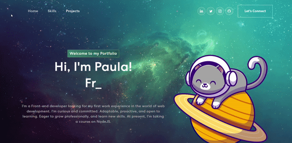

# Personal portfolio



## Table of contents
* [General info](#general-info)
* [Technologies](#technologies)
* [Setup](#setup)

## General info
This is my personal portfolio! I did it not only to introduce myself, but also to keep on practicing the technologies I know so far.
	
## Technologies
Project is created with:
* React JS
* TypeScript
* Bootstrap
	
## Setup
To run this project, install it locally using npm:

```
$ npm install
$ npm start
```

## Let's get in touch

- E-mail: dumraufp@gmail.com
- Twitter: @pdumrauf
- LinkedIn: https://www.linkedin.com/in/pauladumrauf/